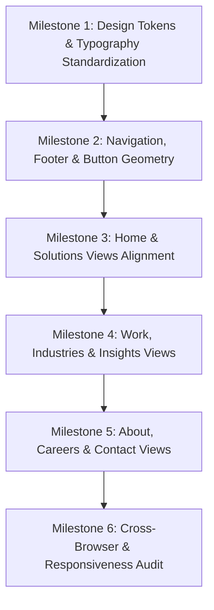

# SGS (Sanskar Growth Solutions) — UI Implementation & Redesign Plan

> **Single Source of Truth**: This plan operationalizes the official SGS Brand Guidelines into a production-grade, cohesive B2B technology + growth application interface. It strictly enforces the brand colors, typographic hierarchy, geometric motifs, layout rhythm, component tokens, and UX rules.

---

## 1. Executive Summary & Brand Positioning

- **Company**: Sanskar Growth Solutions (SGS)
- **Positioning**: Business growth partner accelerating startups, SMEs, and mid-market organizations through integrated Technology, Performance Marketing, Brand Building, Business Media, Management Consulting, and Applied AI.
- **Brand Personality**: Strategic, Professional, Confident, Clear, Innovative, Reliable.
- **Visual Identity Directive**: Serious, premium B2B technology + growth company.
- **Explicit Anti-Patterns to Eliminate**:
  - ❌ No generic startup SaaS templates or cartoonish illustrations.
  - ❌ No decorative serif/script fonts (`Playfair Display`, `Caveat`) — typography must strictly be **Space Grotesk** + **DM Sans**.
  - ❌ No excessive pill-shaped buttons; standardize on professional, geometric rounded rectangles (e.g., `rounded-xl` / `rounded-lg`).
  - ❌ No excessive gradients, glassmorphism, or neon cyberpunk glows.
  - ❌ No "wall of cards" layouts; use cards strictly for structured data, using whitespace and geometric blocks elsewhere.
  - ❌ No AI-generated or generic stock visuals.

---

## 2. Core Brand Design Tokens & System Foundation

### 2.1 Color System Architecture

| Token Name | Hex Code | Role & Usage Restrictions |
| :--- | :--- | :--- |
| **Midnight** | `#0F1B64` | **Primary Brand Canvas**: Deep headers, dark navigation, primary dark sections, footer, high-authority cards. |
| **Midnight Dark** | `#080E32` | **Ultra-Deep Contrast**: Base background for dark-mode canvas and deep modal backdrops. |
| **Lime Charge** | `#AFEB00` | **Primary Accent & Growth Indicator**: Main CTA button backgrounds, key performance metrics, active highlights, text selection. |
| **Electric Blue** | `#2033FF` | **Strategic Secondary Accent**: Section backdrops, secondary CTAs, hyperlinks, active nav indicators, interactive borders. |
| **Cloud** | `#F5FAFF` | **Secondary Neutral Surface**: Light section canvas, card backgrounds, balanced whitespace, subtle dividers. |
| **White** | `#FFFFFF` | **Elevated Light Surface**: Elevated cards on Cloud canvas, crisp contrast. |
| **Ink** | `#141414` | **Primary High-Contrast Typography**: Headings and body text on light (Cloud/White) surfaces; label text on Lime buttons. |
| **Ink Muted** | `#525252` | **Secondary Typography**: Supporting descriptions, metadata, timestamps. |
| **Border Neutral** | `#E2E8F0` / `#DDE8F5` | **Restrained Borders**: Clean 1px structural framing without harsh drop shadows. |

### 2.2 Typography Scale & Rules

Strict adherence to **Space Grotesk** (Headings & Labels) and **DM Sans** (Body & UI text):

| Typographic Level | Font Family | Size (Desktop / Mobile) | Weight | Line Height | Usage |
| :--- | :--- | :--- | :--- | :--- | :--- |
| **Title / Hero (H1)** | Space Grotesk | `60px` (`text-4xl` to `6xl`) | Bold (700) | `1.05 - 1.1` | Main page hero titles, high-impact statements |
| **Heading (H2)** | Space Grotesk | `32px` (`text-2xl` to `4xl`) | SemiBold / Bold (600/700) | `1.15` | Major section headers |
| **Subtitle (H3)** | DM Sans | `24px` (`text-xl` to `2xl`) | Medium (500) | `1.3` | Supporting section intros, feature titles |
| **Section Header / Kicker** | Space Grotesk | `16px` (`text-xs` to `sm`) | Bold (700), Tracking `0.2em` | `1.4` | Category kickers, eyebrow labels, mono tags |
| **Subheading (H4)** | Space Grotesk | `14px - 16px` | SemiBold (600) | `1.4` | Card titles, modal headers |
| **Body Copy** | DM Sans | `14px - 16px` | Regular (400) | `1.6` | Paragraphs, service descriptions, case narratives |
| **Quote / Callout** | DM Sans | `18px - 20px` | Medium / SemiBold | `1.4` | Executive testimonials, pull-quotes |
| **Caption / Fineprint** | DM Sans | `11px - 12px` | Regular / Medium | `1.4` | Form labels, legal disclaimers, microcopy |

---

## 3. Logo, Brand Geometry & Motifs

1. **Logo Standardization**:
   - Utilize official SGS monogram and SVG wordmark ("SANSKAR GROWTH SOLUTIONS").
   - Preserve clear space equal to the height of the "S" mark.
   - For compact digital spaces (mobile navigation, sticky headers, favicons), use the standalone SGS monogram.
   - Prohibit recreation of the logo using plain HTML text or custom CSS fonts.

2. **Geometric Motifs**:
   - Diagonal 45° growth accents (reflecting the upward momentum of the monogram).
   - Clean rectangular bounding grids with subtle 1px borders (`border-white/10` or `border-slate-200`).
   - Restrained circular/elliptical background glows in `#AFEB00` (low opacity `5%-8%`) and `#2033FF` (`10%`) to create depth without neon clutter.

---

## 4. UI Component Architecture & Rules

### 4.1 Buttons & Interactive CTA Hierarchy
- **Primary CTA**:
  - Background: `bg-[#AFEB00]` (Hover: `bg-[#9CD600]`)
  - Text: `text-[#141414]` or `text-[#0F1B64]` (Space Grotesk / DM Sans Bold)
  - Geometry: `rounded-xl` or `rounded-lg` with `px-6 py-3.5` (avoid pill-shaped buttons except for micro-tags/pills)
  - State: Subtle `hover:-translate-y-0.5 shadow-md shadow-[#AFEB00]/20 active:translate-y-0`
- **Secondary CTA**:
  - On Dark: `bg-[#0F1B64] border border-white/20 text-white hover:bg-[#121E6E]` or `bg-white/10 text-white hover:bg-white/20`
  - On Light: `bg-[#0F1B64] text-white hover:bg-[#0A1245]` or outline `border border-[#0F1B64] text-[#0F1B64] hover:bg-[#F5FAFF]`
- **Text / Inline CTA**:
  - `text-[#2033FF] hover:text-[#0F1B64]` (Light mode) or `text-[#AFEB00] hover:text-white` (Dark mode) with directional arrow icon.

### 4.2 Card Design & Information Density
- Remove "wall of cards" syndrome.
- Restrain card radius to `rounded-2xl` or `rounded-xl` (eliminate oversized `rounded-3xl` bubble cards).
- Surfaces:
  - Light Canvas: `bg-white` or `bg-[#F5FAFF]` with `border border-slate-200 shadow-sm hover:shadow-md`.
  - Dark Canvas: `bg-[#0A1245]` with `border border-white/10 hover:border-[#AFEB00]/50`.
- Background Image Cards: Maintain subtle gradient overlays so photography is crisp and visible (75%-85% image opacity with bottom-only legibility fade).

### 4.3 Navigation Architecture
- **Desktop**:
  - Background: Midnight `#080E32` with subtle blur and 1px border `border-white/10`.
  - Links: DM Sans font, `text-slate-300 hover:text-white`, active state indicated by `#AFEB00` underline or pill indicator.
  - Primary Action: "Book Executive Briefing" / "Contact Us" in Lime Charge `#AFEB00`.
- **Mobile**:
  - Clean slide-down sheet in Midnight `#080E32`.
  - SGS Monogram + high-contrast navigation links + prominent Lime CTA.

---

## 5. Website Section Rhythm & Structural Transitions

Ensure natural visual rhythm and avoid repetitive or monotonous sections:

```
[ Hero Section — Midnight #080E32 + Space Grotesk H1 + Lime CTA #AFEB00 ]
                              ↓
[ Proof / Metrics Strip — Midnight #080E32 + Lime #AFEB00 Highlights ]
                              ↓
[ Value Proposition / Editorial Grid — Light Cloud #F5FAFF + Crisp White Cards ]
                              ↓
[ Core Capabilities / Solutions Matrix — Midnight #0A1245 + Electric Blue #2033FF ]
                              ↓
[ Approach & Growth Architecture — Crisp White / Cloud #F5FAFF + Structured Timeline ]
                              ↓
[ Strategic Highlight Banner — Electric Blue #2033FF or Midnight Depth #080E32 ]
                              ↓
[ Final Conversion / Summit CTA — Midnight #080E32 + Lime CTA #AFEB00 ]
                              ↓
[ Executive Footer — Midnight #080E32 + Cloud Details + Restrained Monogram ]
```

---

## 6. Page-by-Page Audit & Implementation Plan

### 6.1 Global Theme & Tokens (`index.css` & `index.html`)
- Update Lime Charge token to exact brand specification `#AFEB00` (replacing `#AFEB00`).
- Remove imports and references to non-brand fonts (`Playfair Display`, `Caveat`).
- Enforce default `font-heading: 'Space Grotesk'` and `font-body: 'DM Sans'`.
- Replace legacy pill radiuses (`rounded-full` on standard buttons) with geometric `rounded-xl` / `rounded-lg`.

### 6.2 Component Refinements
1. **Navbar ([Navbar.tsx](file:///d:/Sanskar/frontend/src/components/Navbar.tsx))**:
   - Ensure official SGS monogram & wordmark SVG rendering.
   - Refine CTA button to Lime `#AFEB00` with geometric `rounded-xl`.
   - Typography to Space Grotesk / DM Sans.
2. **Hero ([Hero.tsx](file:///d:/Sanskar/frontend/src/components/Hero.tsx))**:
   - Standardize H1 to Space Grotesk 60px desktop.
   - Primary CTA to `#AFEB00` with Ink `#141414` text.
   - Remove any remaining italic serif or script styling.
3. **Solutions Matrix & Grid ([GrowthSolutionsGrid.tsx](file:///d:/Sanskar/frontend/src/components/GrowthSolutionsGrid.tsx))**:
   - Align capability cards to clean 1px borders, crisp typography, and restrained shadows.
4. **Footer ([Footer.tsx](file:///d:/Sanskar/frontend/src/components/Footer.tsx))**:
   - Background Midnight `#080E32`, links in DM Sans, newsletter form with `#AFEB00` button.
5. **Modals ([ProjectInitiationModal.tsx](file:///d:/Sanskar/frontend/src/components/ProjectInitiationModal.tsx), [GrowthDiagnosticModal.tsx](file:///d:/Sanskar/frontend/src/components/GrowthDiagnosticModal.tsx))**:
   - Surface Midnight `#0A1245`, inputs with `#2033FF` focus rings, `#AFEB00` submit buttons.

### 6.3 Views Refinements
- **HomeView ([HomeView.tsx](file:///d:/Sanskar/frontend/src/views/HomeView.tsx))**:
  - Replace any script/serif accents with bold Space Grotesk italics or Electric Blue highlights.
  - Standardize button geometry to `rounded-xl`.
  - Ensure solution cards maintain balanced overlay and clear typography.
- **SolutionsView ([SolutionsView.tsx](file:///d:/Sanskar/frontend/src/views/SolutionsView.tsx))**:
  - Enforce Cloud `#F5FAFF` and Midnight `#080E32` section flow.
  - Tab selectors in Space Grotesk.
- **WorkView ([WorkView.tsx](file:///d:/Sanskar/frontend/src/views/WorkView.tsx))**:
  - Case study cards with refined 1px borders, bold metric callouts in `#AFEB00`.
- **IndustriesView ([IndustriesView.tsx](file:///d:/Sanskar/frontend/src/views/IndustriesView.tsx))**:
  - Sector breakdowns in structured editorial layout rather than dense card clutter.
- **InsightsView ([InsightsView.tsx](file:///d:/Sanskar/frontend/src/views/InsightsView.tsx))**:
  - Clean publication layout with Space Grotesk headers and DM Sans body.
- **AboutView ([AboutView.tsx](file:///d:/Sanskar/frontend/src/views/AboutView.tsx))**:
  - Leadership profiles, corporate mission, timeline in Space Grotesk and DM Sans.
- **CareersView ([CareersView.tsx](file:///d:/Sanskar/frontend/src/views/CareersView.tsx))**:
  - Open positions table, application modal in Midnight and Cloud.
- **ContactView ([ContactView.tsx](file:///d:/Sanskar/frontend/src/views/ContactView.tsx))**:
  - Executive engagement brief form, partner SLA tags, NDA protection badges.

---

## 7. Implementation Milestones



1. **Phase 1: Design Tokens & Typography Foundation**
   - Update `index.css` and `index.html`: set `--color-lime: #AFEB00`, remove non-brand fonts, configure type scale tokens.
2. **Phase 2: Core Components & Button Geometry**
   - Refactor `Navbar`, `Footer`, and shared button/modal components to geometric standards.
3. **Phase 3: Primary Commercial Pages**
   - Polish `HomeView`, `SolutionsView`, and `WorkView`.
4. **Phase 4: Sector, Media & Corporate Pages**
   - Polish `IndustriesView`, `InsightsView`, and `AboutView`.
5. **Phase 5: Conversion & Intake Funnels**
   - Polish `CareersView` and `ContactView`.
6. **Phase 6: Quality Assurance & Build Verification**
   - Run full typecheck and production build (`npm run build`).
   - Audit color contrast, responsive breakpoints (desktop, tablet, mobile), and performance.

---

## 8. Verification & Acceptance Criteria

- [ ] **Color Accuracy**: 100% compliance with Midnight (`#0F1B64`), Lime Charge (`#AFEB00`), Electric Blue (`#2033FF`), Cloud (`#F5FAFF`), and Ink (`#141414`).
- [ ] **Typography Uniformity**: Zero usage of unapproved fonts (`Caveat`, `Playfair Display`). Headings strictly in **Space Grotesk**; body strictly in **DM Sans**.
- [ ] **Geometry Consistency**: Standardized professional button radiuses (`rounded-xl` / `rounded-lg`); absence of arbitrary pill buttons.
- [ ] **Layout Quality**: Balanced section contrast between dark (Midnight), light (Cloud/White), and accent (Electric Blue).
- [ ] **Build Health**: Zero TypeScript compiler errors; clean production bundle with `npm run build`.
